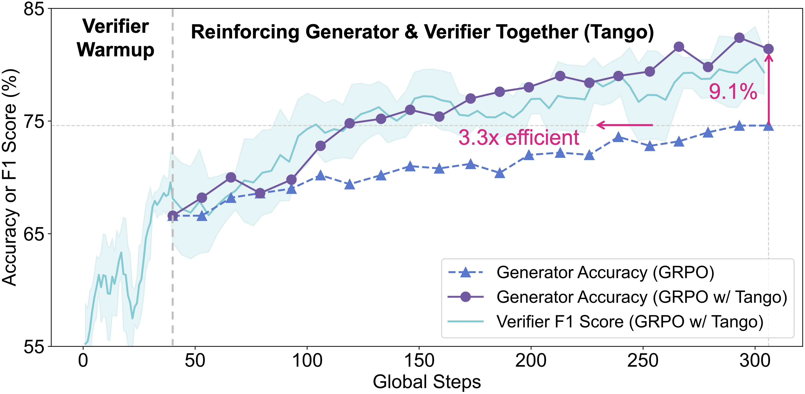

<div align="center">
<h2 style="display: flex; justify-content: center; align-items: center; gap: 10px; margin: 0;">
  RL Tango: Reinforcing Generator and Verifier Together for Language Reasoning
</h2>
</div>
<p align="center">
  <p align="center">
    <a href="https://people.csail.mit.edu/kzha/">Kaiwen Zha</a><sup>*,1</sup>,
    <a href="https://zhengqigao.github.io/">Zhengqi Gao</a><sup>*,1</sup>,
    <a href="https://maohaos2.github.io/Maohao/">Maohao Shen</a><sup>1</sup>,
    <a href="https://williamd4112.github.io/">Zhang-Wei Hong</a><sup>2</sup>,
    <a href="https://boning.mit.edu/boning/">Duane S. Boning</a><sup>1</sup>,
    <a href="https://people.csail.mit.edu/dina/">Dina Katabi</a><sup>1</sup>
    <br>
    <sup>1</sup>MIT&nbsp;&nbsp;&nbsp;&nbsp;<sup>2</sup>MIT-IBM Watson AI Lab
    <br><b>NeurIPS 2025</b>
  </p>
  <h4 align="center"><a href="https://arxiv.org/abs/2505.15034">Paper</a> | <a href="https://github.com/kaiwenzha/rl-tango">Code</a></h4>
</p>

<div align="center">

</div>

## Abstract

RL Tango is a novel framework that uses RL to concurrently train both an LLM generator and a verifier in an interleaved manner. A central innovation of Tango is its generative, process-level LLM verifier, which is trained via RL and co-evolves with the generator. Importantly, the verifier is trained solely based on outcome-level verification correctness rewards without requiring explicit process-level annotations. This generative RL-trained verifier exhibits improved robustness and superior generalization compared to deterministic or SFT-trained verifiers, fostering effective mutual reinforcement with the generator. Extensive experiments demonstrate that both components of Tango achieve state-of-the-art results among 7B/8B-scale models: the generator attains best-in-class performance across five competition-level math benchmarks and four challenging out-of-domain reasoning tasks, while the verifier leads on the ProcessBench dataset. Remarkably, both components exhibit particularly substantial improvements on the most difficult mathematical reasoning problems.

## Core Files
- [**`verl/trainer/main_rl_tango.py`**](https://github.com/kaiwenzha/rl-tango/blob/main/verl/trainer/main_rl_tango.py): Main entry script for RL Tango training that sets up the environment (e.g., Ray, reward manager, resource pools), and launches the training process.
- [**`verl/trainer/ppo/rl_tango_trainer.py`**](https://github.com/kaiwenzha/rl-tango/blob/main/verl/trainer/ppo/rl_tango_trainer.py): Core trainer class implementing the co-evolution of generator and verifier models through interleaved RL training, reward computation, and coordinated optimization.
- [**`verl/workers/verifier_worker.py`**](https://github.com/kaiwenzha/rl-tango/blob/main/verl/workers/verifier_worker.py): The worker class for the verifier model that handle verification input preparation and structured result extraction from verification outputs.

## Installation
#### Environment Setup
```bash
git clone https://github.com/kaiwenzha/rl-tango.git
cd rl-tango

conda create -n tango python==3.10
conda activate tango
pip install -e '.[vllm]'
pip install ninja
pip install flash-attn --no-build-isolation
```

#### Download Models
```bash
mkdir base_models
huggingface-cli download Qwen/Qwen2.5-Math-7B \
  --local-dir ./base_models/Qwen2.5-Math-7B --local-dir-use-symlinks False
huggingface-cli download Qwen/Qwen2.5-7B \
  --local-dir ./base_models/Qwen2.5-7B --local-dir-use-symlinks False
huggingface-cli download meta-llama/Llama-3.1-70B-Instruct \
  --local-dir ./base_models/Llama-3.1-70B-Instruct --local-dir-use-symlinks False
```

#### Prepare Datasets
```bash
# training datasets
python data_preprocess/eurus2_sft.py
python data_preprocess/eurus2_rl.py

# evaluation datasets
mkdir -p ./data/StrategyQA
wget -P ./data/StrategyQA https://huggingface.co/datasets/voidful/StrategyQA/resolve/main/strategyqa_train.json
python data_preprocess/prepare_strategyqa.py

mkdir -p ./data/TableBench
wget -P ./data/TableBench https://huggingface.co/datasets/Multilingual-Multimodal-NLP/TableBench/resolve/main/TableBench.jsonl

python data_preprocess/prepare_eval_benchmarks.py
```

## Running
We run our experiments on 4 nodes with 8×A100 GPUs each. Other compute resource configurations may also work, though we have not evaluated them.

### SFT
#### SFT Data Generation
```bash
# export on all nodes before starting ray
export VLLM_ATTENTION_BACKEND=XFORMERS
# launch the master node of ray
ray start --head
# add the other 3 nodes to the ray cluster
ray start --address ${MASTER_NODE_ADDRESS}:6379

# on the master node, run
bash scripts/run_sft_data_generation.sh
# split SFT data into train/test splits
python data_preprocess/split_parquet.py \
    --input ./data/eurus2_sft_math/llama70b_sft_data_generation.parquet
```

#### SFT Training
```bash
# on node i=0,1,2,3, run
bash scripts/run_sft_generator.sh --nnodes 4 --node_rank ${i} \
    --master_addr ${MASTER_NODE_ADDRESS}
```

### RL Tango
```bash
# similar to above
export VLLM_ATTENTION_BACKEND=XFORMERS
ray start --head
ray start --address ${MASTER_NODE_ADDRESS}:6379

# on the master node, run
bash scripts/run_rl_tango.sh <sft_model_checkpoint_path>
```

## Acknowledgements
Our codebase is built on [veRL](https://github.com/volcengine/verl). Special thanks to this great infrastructure.

## Citation 

If you find our work useful or relevant to your research, please consider citing our paper:

```bib
@article{zha2025rl,
    title={RL Tango: Reinforcing Generator and Verifier Together for Language Reasoning},
    author={Zha, Kaiwen and Gao, Zhengqi and Shen, Maohao and Hong, Zhang-Wei and Boning, Duane S and Katabi, Dina},
    journal={arXiv preprint arXiv:2505.15034},
    year={2025}
}
```
